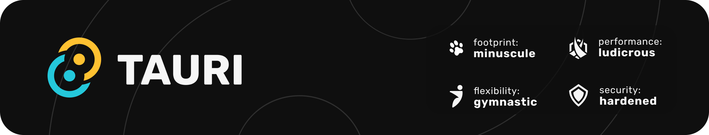

# Refine Boilerplate for Web (PWA), Desktop and Mobile

[](https://github.com/josephgodwinkimani/refine-starter/actions/workflows/release-desktop.yml)
[](https://github.com/josephgodwinkimani/refine-starter/actions/workflows/build-cordova.yml)
[](https://github.com/josephgodwinkimani/refine-starter/actions/workflows/lint.yml)
[](https://github.com/josephgodwinkimani/refine-starter/actions/workflows/lint-rs.yml)


<div align="center" style="margin: 30px;">
    <a href="https://refine.dev">
    
    </a>
</div>

<div align="center" style="margin: 30px;">
    <a href="https://github.com/tauri-apps/tauri">
    
    </a>
</div>

<p align="center">
    <a href="https://github.com/apache/cordova">
    </p>
    </a>
<br/>

This [refine](https://github.com/refinedev/refine) project was generated with [create refine-app](https://github.com/refinedev/refine/tree/master/packages/create-refine-app).

Refine is a React Framework for building internal tools, admin panels, dashboards & B2B apps with unmatched flexibility ✨

Refine's hooks and components simplifies the development process and eliminates the repetitive tasks by providing industry-standard solutions for crucial aspects of a project, including authentication, access control, routing, networking, state management, and i18n.

To manage data, refine needs a data provider, which is a function that implements the DataProvider interface. It is responsible for communicating with your API and making data available to refine applications.

Comes with the *Rest Data Provider*, but you can easily switch to [GraphQL data provider](https://github.com/refinedev/refine/tree/master/packages/graphql) or any other provider you prefer. You also have the option to replace the entire Refine project with your own.

<p align="center">
    <i>On the web</i>
        
    <br />
    <br />
        <i>On windows desktop</i>
    <br />
    <br />
        
    <br />
    <br />
        <i>On android mobile</i>
    <br />
    <br />
        
</p>

## Prerequisites

_to build a desktop app_

1. [Microsoft Visual Studio C++ Build Tools](Prerequisites)
2. [WebView2 runtime](https://developer.microsoft.com/en-us/microsoft-edge/webview2/#download-section) (distributed as part of windows 10/11)
3. [Rust](https://www.rust-lang.org/)

_to build android app_

4. [JDK 15 and above](https://adoptium.net/en-GB/installation/)
5. [Gradle 7.6 and above](https://gradle.org/install/)
6. [Android SDK 30.0.2 and above](https://developer.android.com/studio/install) 

## Getting Started

```bash
    pnpm install -g cordova
```

## Available Scripts

### Running the development server.

```bash
    pnpm run dev
```

### Building for production.

```bash
    pnpm run build
```

### Running the production server.

```bash
    pnpm run start
```

### Running your dekstop app.

```bash
    pnpm tauri dev
```

### Building your desktop app for production.

```bash
    pnpm tauri build
```

### Running the debug app for Android.

> plug a handset into your computer and test the app directly

```bash
    pnpm run android # pnpm run ios
```

### Building your Android app.

> You can add ios app using `cd cordova && cordova platform add ios`

```bash
    pnpm run android:build # pnpm run ios:build
    # you can always use android studio to build a release
```
## Related Projects

- [Nest.js GraphQL, Prisma, Docker API Starter](https://github.com/josephgodwinkimani/nestjs-graphql-prisma) — Nest.js Hybrid Application (HTTP server with microservice listeners) with GraphQL (schema first), Prisma, MySQL (easily replaceble), MongoDB, Jest, Docker.
- [Laravel Boilerplate for building REST APIs](https://github.com/josephgodwinkimani/laravel-api-boilerplate) — A Laravel boilerplate for building REST APIs that support multi-tenancy, multiple MIME types using Fractal, API documentation, Eloquent model monitoring, and other credible libraries. 
- 

## Learn More

To learn more about **refine**, please check out the [Documentation](https://refine.dev/docs)

- **REST Data Provider** [Docs](https://refine.dev/docs/core/providers/data-provider/#overview)
- **Material UI** [Docs](https://refine.dev/docs/ui-frameworks/mui/tutorial/)
- **Inferencer** [Docs](https://refine.dev/docs/packages/documentation/inferencer)
- **Custom Auth Provider** [Docs](https://refine.dev/docs/core/providers/auth-provider/)
- **i18n** [Docs](https://refine.dev/docs/core/providers/i18n-provider/)
- **React Router** [Docs](https://refine.dev/docs/core/providers/router-provider/)

## License

MIT
